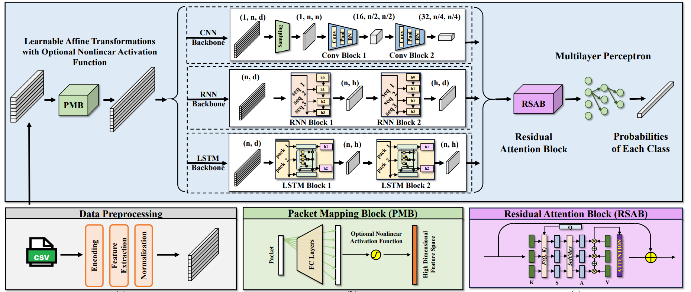

# SISSA: Real-time Monitoring of Hardware Functional Safety and Cybersecurity with In-vehicle SOME/IP Ethernet Traffic
Qi Liu, Xingyu Li, Ke Sun, Yufeng Li*, Yanchen Liu*

</img>
</img>

## Dataset
The dataset used in our paper is avaliable at [Google Drive](https://drive.google.com/file/d/1-pl9OOFcTZCuPLRzusjlmkMn7Q-f-0fU/view?usp=drive_link).

Please check [Dataset Description](./docs/Dataset_Description.md) for detailed description of our generated dataset.

Please check [Prepare for Dataset](./docs/Prepare_for_Dataset.md) to prepare the required dataset to reproduce our experiment results.

## Installation

Please check [Installation Guide](./docs/Installation_Guide.md) to install the required python environment.

## Modify YAML Configuration Files \[TODO\]

## Train and Test

By modifing the YAML files in "./config" directory, you can easily train the model and test it with following commands:

```bash
# Train
bash scripts/train.sh
# Test
bash scripts/test.sh
```