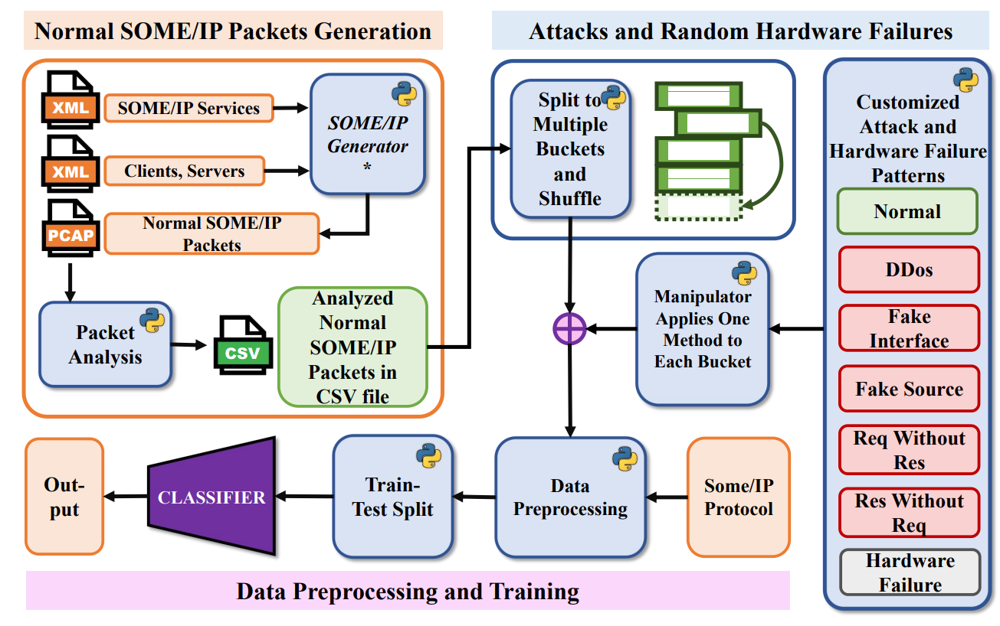

# Dataset Description
## Contribution
We propose a SOME/IP data generation method for establishing a baseline for normal communication evaluation. It encompasses the classes of attack, functional failure and normal. 

## Introduction and generation methods

In SISSA, we delineate a holistic approach encompassing the generation of standard data, the simulation of various attacks and random hardware failures, alongside meticulous data preprocessing and network training methodologies.

We propose enhancements to the [Some/IP Generator](https://github.com/Egomania/SOME-IP_Generator). Our approach leverages its multi-ECU communication simulation capabilities to first generate standard Some/IP traffic packets. Subsequently, we aim to **model in-vehicle functional safety and cyber security threats**. This will be achieved through custom scripts that can generate **specific attack** message windows and simulate **random hardware failure** message windows, thereby providing a more robust and realistic testing environment for monitoring systems.

Following figure shows the dataset generation process for SOME/IP. By utilizing the SOME/IP Generator, we initiate the process by generating a corpus of typical SOME/IP communication data.  
This data is subsequently processed through our data segmentation module. In this phase, the continuous stream of data is partitioned into distinct blocks. These blocks are subjected to simulated attack or failure scenarios after shuffling.  
Subsequently, each block is further subdivided into multiple, equal-length windows, allocated to respective buckets based on the classification task’s category. In our case, this results in seven buckets, each containing diverse Windows subjected to identical attack simulations.  
To enhance the realism and variability of these simulations, we introduce adjustable parameters, ensuring that each attack instance retains a unique characteristic. 

</img>

Following table shows the details of our training set and validation set window data. A critical aspect of our approach is **the strict equalization of windows across different categories**, a measure implemented to preclude any potential training bias due to data imbalances at the simulation stage. 

| Class | Training dataset | Validation dataset |
|:---:|:---:|:---:|
| Normal | 2058 * 128 | 515 * 128 |
| DDos | 2058 * 128 | 515 * 128 |
| Fake Interface | 2058 * 128 | 515 * 128 |
| Fake Source | 2058 * 128 | 515 * 128 |
| Req without Res | 2058 * 128 | 515 * 128 |
| Res without Req | 2058 * 128 | 515 * 128 |
| Hardware Failure | 2058 * 128 | 515 * 128 |
| Total| 2058 * 128 * 7 | 515 * 128 * 7 |

Upon the generation of bucketed data, we engage in a series of preprocessing and feature engineering steps. The window data within each bucket is then randomized and split into 
training and validation sets in an 8:2 ratio. Once segmented into these sets and saved as .npy files, the data is primed for neural network training. 
